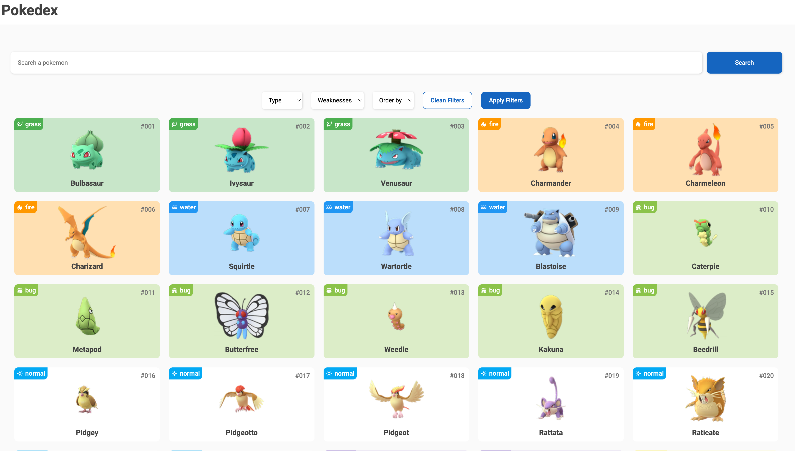

# Pokedex - Entrega #3

La empresa COMPUMUNDOHIPERMEGARED ha decidido contratarte para darle vida a un sitio web. Su idea es construir la mejor Pokedex que pueda haber existido en toda la historia. Para ello, te compartiran todo el Markup de su aplicación (HTML y CSS). 
Tu misión, si decides aceptarla,  será agregar dinamismo al sitio web propuesto (JS).

Para llevar al resultado esperado, la empresa te propone dividir todo el trabajo en hitos. A continuación la descripción de cada uno:

## Hito 1 - Renderiza todos los pokemones:

#### Peso: 20%

La empresa te comparte un archivo `pokemon.JSON` ubicado en la carpeta `data` en donde podrás encontrar la información de los 250 pokemones pertenecientes a la primera generación. Además, en el archivo `index.js` encontrarás que ya se está consumiendo la información ubicada en el archivo `.JSON`.

#### Objetivo
Utiliza JS para iterar los datos ubicados en el archivo `pokemon.JSON` y renderizar/pintar la información de los 250 pokemones presentes en el archivo. La información que deberás mostrar será la que mejor se ajuste al markup propuesto por la empresa.

## Hito 2 - Filtrado

#### Peso: 20%

Ahora que podemos renderizar los 250 pokemones, la empresa desea agregar la funcionalidad de poderlos filtrar por tipo y/o debilidades. 

#### Objetivo

Utiliza  JS para agregar la funcionalidad de filtrado a los `select` y a los botones presentes en el markup.

A considerar:
- Los filtros deberían funcionar de forma anidada. Es decir, que si el usuario quire filtrar por tipo y por debilidad al mismo tiempo, la aplicación debería tener en cuenta ambas elecciones y no una sola.
- Al presionar el `Clean Filters`, el usuario debería poder ver todo el listado de los 250 pokemones nuevamente.
- Utiliza el botón `Apply Filters` para obtener el o los tipos de filtros a aplicar y luego filtra el conjunto de datos según la o las selecciones.

## Hito 3 - Búsqueda

#### Peso: 20%

En este punto la aplicación debería poder mostrar los 250 pokemons y filtrarlos por tipo y/o debilidad. Es momento de agregar la funcionalidad de búsqueda.

#### Objetivo

Utiliza JS para agregar la funcionalidad de búsqueda por nombre a la aplicación.

A considerar:
- Una vez el usuario ingrese el nombre de un pokemon y presione el botón `Search`, la aplicación debe mostrar el o los pokemones que se ajusten con la cadena de texto ingresada en la barra de búsqueda
- No es obligatorio que la búsqueda y de filtrado funcionen al mismo tiempo. Asume que el usuario utilizará una u otra

## Hito 4 - Ordenamiento

#### Peso: 20%

Ahora que tenemos la búsqueda, el filtrado y el renderizado para los 250 pokemones, es momento de agregar la funcionalidad de ordenar

#### Objetivo

Utiliza JS para agregar la funcionalidad de ordenamiento por nombre de forma ascendente (A-Z) y descendente (Z-A)

## A tener en cuenta

- La entrega deberá ser desarrollada enteramente utilizando Javascript. El único HTML que podrás utilizar será el que requieras dentro de tu JS
- No es necesario agregar/editar el HTML/CSS
- Deberás subir tu solución a github-pages (Una sola página por equipo)
- Al finalizar la entrega, cada integrante del equipo deberá haber hecho como mínimo 2 commits.